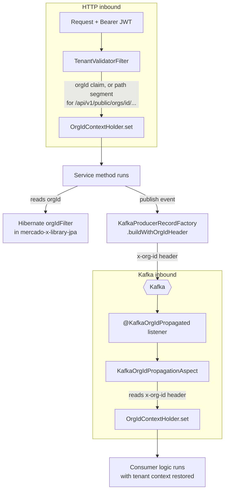

# MercadoX Context

## Overview

`mercado-x-context` is the cross-cutting infrastructure library shared by every MercadoX microservice: JWT verification, multi-tenant context propagation (across both HTTP and Kafka), idempotency enforcement, and Kafka producer/consumer configuration. It is a library, not a service — it auto-configures itself into whichever Spring Boot application depends on it.

The single idea tying this module together: **`orgId` has to survive every hop** — HTTP request → service logic → Kafka event → consuming service → its own persistence layer — without every developer manually threading it through method signatures. This module is the plumbing that makes that automatic.

---

## Responsibilities

- RSA JWT verification (`JwtVerifier`, auto-configured via `MercadoXJwtAutoConfiguration`)
- Tenant context propagation over HTTP (`TenantValidatorFilter`) and Kafka (`KafkaOrgIdPropagationAspect`)
- Idempotency enforcement at the API boundary (`@IdempotentOperation`) and the Kafka consumer boundary (`@KafkaIdempotent`)
- Kafka producer/consumer factory configuration (`KafkaPubSubConfig`)
- A shared, pre-configured `WebClient.Builder`

---

## Tenant Context Propagation

`OrgIdContextHolder` is a `ThreadLocal<String>` — the single source of truth every other module (`mercado-x-library-jpa`'s Hibernate filter aspect, `mercado-x-core`'s services) reads `orgId` from. Three mechanisms keep it populated correctly across process and transport boundaries:



- **`TenantValidatorFilter`** resolves `orgId` from the JWT's `orgId` claim when present. For anonymous endpoints that can't carry a JWT (e.g. the public lead-capture endpoint `/api/v1/public/orgs/{orgId}/leads`), it falls back to parsing the org ID out of the URL path itself, then hands it to a service-supplied `AnonymousTenantValidator` implementation to confirm the org actually exists before trusting it. The filter only activates when a service registers an `AnonymousTenantValidator` bean (`@ConditionalOnBean`) — services with no anonymous/public endpoints don't pay for it.
- **`KafkaProducerRecordFactory.buildWithOrgIdHeader`** stamps the current `orgId` onto outbound Kafka records as an `x-org-id` header, so tenant context survives the hop across the message broker where there's no request/JWT to carry it.
- **`KafkaOrgIdPropagationAspect`** (triggered by `@KafkaOrgIdPropagated` on a `@KafkaListener` method) reads that header back off the `ConsumerRecord` and repopulates `OrgIdContextHolder` for the duration of the listener invocation, clearing it afterward — since `ThreadLocal` state doesn't survive across the thread-pool boundary between producer and consumer otherwise.

`OrgIdContextHolder.clear()` is called in a `finally` block on both the HTTP filter and the Kafka aspect specifically to avoid thread-pool leakage — Tomcat and Kafka listener container threads are reused, so a context left set would leak the previous request's tenant into the next one on the same thread.

---

## JWT Verification

`mercado-x-oauth` is the only service holding the RSA private key. Every other service depends on this module to verify tokens **locally, offline** — no network call back to oauth per request:

- `MercadoXJwtAutoConfiguration` — Spring Boot `@AutoConfiguration` that wires an `RSAPublicKey` (loaded via `PublicKeyUtils` from `security.jwt.public-key-location`) and a `JwtVerifier`, both `@ConditionalOnMissingBean` so a consuming service can override either if it ever needs to.
- `JwtVerifier` — parses and verifies the signature, requires `iss = mercadox-oauth`, and extracts subject/`orgId`/roles into a `VerifiedJwt` record.
- `JwtAuthFilter` — populates Spring Security's `SecurityContextHolder` with the verified identity and roles so `@PreAuthorize` checks downstream work normally.

---

## Idempotency

Two related but distinct mechanisms, applied at different boundaries:

| Annotation | Boundary | Backing check | Semantics |
|---|---|---|---|
| `@IdempotentOperation` | Synchronous API call (`IdempotencyAspect`) | Single atomic `SETNX` (`setIfAbsent`) via `StringRedisTemplate` | Duplicate request rejected outright; key deleted on failure so a genuine error can be retried |
| `@KafkaIdempotent` | Kafka consumer (`KafkaIdempotencyAspect`, delegates to `RedisIdempotencyChecker` in `mercado-x-redis`) | Separate `isDuplicate()` **GET** then `markProcessed()` **SETNX** | Known TOCTOU gap under concurrent redelivery of the same `eventId` — tracked in the email service's `TODO.md`, not yet collapsed into one atomic call the way the API-level check was |

Both key their Redis entry off an application-supplied ID (`IdempotentRequest.getIdempotencyKey()` for API calls, `DomainEvent.getEventId()` for Kafka events) rather than inferring one from the payload — the caller/producer is responsible for supplying a stable ID.

---

## Kafka Pub/Sub Configuration

`KafkaPubSubConfig` provides the producer/consumer factories every service uses: values are serialized as JSON with type-info headers (`JsonSerializer`/`JsonDeserializer` with `ADD_TYPE_INFO_HEADERS`), and the consumer's `JsonDeserializer.TRUSTED_PACKAGES` is restricted to `hn.shadowcore.mercadox.*` so a crafted `__TypeId__` header can't force deserialization of an arbitrary class.

Note: `mercado-x-library-entity` also declares Avro schemas (`src/main/avro/*.avsc`) for schema-registry compatibility tracking, but the wire format actually produced by this config is JSON, not Avro-encoded — the generated Avro classes aren't referenced by any producer/consumer code today.

---

## Configuration Reference

```yaml
security:
  jwt:
    public-key-location: ${JWT_PUBLIC_KEY_LOCATION:file:./secrets/public.pem}

spring:
  kafka:
    bootstrap-servers: ${KAFKA_BOOTSTRAP_SERVERS:localhost:9092}
```

---

## Internal Dependencies

| Module | Purpose |
|---|---|
| `mercado-x-library-entity` | `DomainEvent`, `IdempotentRequest`, entity/DTO types referenced by the aspects |
| `mercado-x-redis` | `RedisIdempotencyChecker` backing `@KafkaIdempotent`; `StringRedisTemplate` backing `@IdempotentOperation` |

---

## Used By

- `mercado-x-oauth`
- `mercado-x-core`
- `mercado-x-email`
